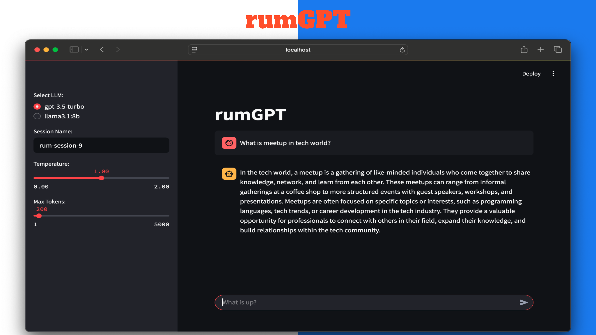

# rumGPT
rumGPT is a self-initiated hobby project built on a large language model framework to deepen my hands-on understanding of parameterization and model behavior. The initial prototype was crafted as the centerpiece demo for my recent meetup talk showcasing LLM Observability while serving as a dynamic, self-learning playground.

This is my rumGPT using streamlit.

* Free software: MIT license
* Documentation: TODO

Features
--------

* TODO

Credits
-------

This package was created with Cookiecutter_ and the `audreyr/cookiecutter-pypackage`_ project template.

.. _Cookiecutter: https://github.com/audreyr/cookiecutter
.. _`audreyr/cookiecutter-pypackage`: https://github.com/audreyr/cookiecutter-pypackage
